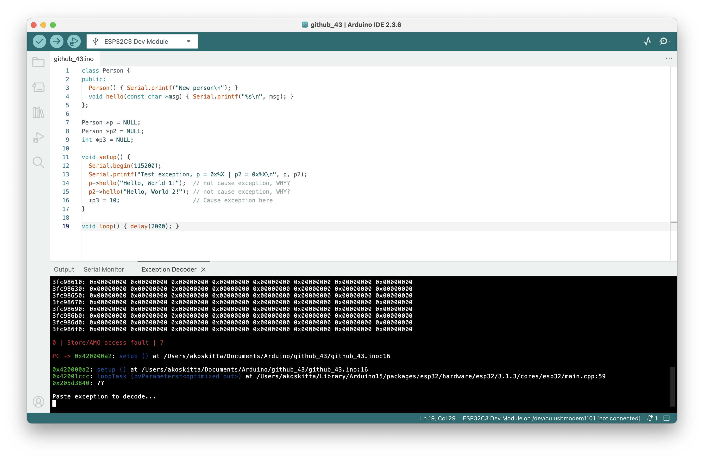

# ESP Exception Decoder

[](https://github.com/dankeboy36/esp-exception-decoder/actions/workflows/build.yml)

> ⚠️ This project is in an early state.

[Arduino IDE](https://github.com/arduino/arduino-ide/) extension lets you get a more meaningful explanation of the stack traces and backtraces you get on ESP8266/ESP32. This extension is the reimplementation of the famous [ESP8266/ESP32 Exception Stack Trace Decoder](https://github.com/me-no-dev/EspExceptionDecoder) tool, written in Java.



> ⚠️ This extension has nothing to do with the [Visual Studio Code extension for Arduino](https://marketplace.visualstudio.com/items?itemName=vsciot-vscode.vscode-arduino). This extension does not work in VS Code.

## Installation

- Download the latest extension from the GitHub [release page](https://github.com/dankeboy36/esp-exception-decoder/releases/latest). The asset filename is `esp-exception-decoder-${VERSION}.vsix`, where `${VERSION}` is the latest version.
- When the Arduino IDE is not running, copy the downloaded extension into the folder named `plugins` folder under Arduino IDE's configuration folder. If the `plugins` folder does not exist, create it.
  - On Windows, it's under `%UserProfile%\.arduinoIDE\plugins` (which is typically `C:\Users\<username>\.arduinoIDE\plugins` where `<username>` is your Windows username).
  - On Linux and macOS, it's under `~/.arduinoIDE/plugins`.
    > ℹ️ If you get stuck, follow the [_Installation_](https://github.com/arduino/arduino-ide/blob/main/docs/advanced-usage.md#installation) section of the documentation of the Arduino IDE _3rd party themes_. The procedure is the same.

## Usage

- Open a sketch in the Arduino IDE and verify it.
- Upload the sketch to an ESP8266/ESP32 board.
- Open the _Serial Monitor_ view and monitor the output for exceptions.
- When you get an exception, open the _Exception Decoder_ terminal:
  - Open the _Command Palette_ with <kbd>Ctrl/⌘</kbd>+<kbd>Shift</kbd>+<kbd>P</kbd>,
  - Type `ESP Exception Decoder: Show Decoder Terminal` and
  - Press <kbd>Enter</kbd>.
- Copy the exception stack trace/backtrace from the _Serial Monitor_ view.
- Paste the stack trace/backtrace to the _Exception Decoder_ terminal.
  > ℹ️ See more on copy and paste in the terminal [here](https://code.visualstudio.com/docs/terminal/basics#_copy-paste).


### Hints

1.  You can enable blinking cursors in the decoder terminal with the [`"terminal.integrated.cursorBlinking": true`](https://code.visualstudio.com/docs/terminal/appearance#_terminal-cursor) setting.
1.  The `"terminal.enablePaste": true` setting enables pasting to the decoder terminal with the keyboard.
1.  You can tune the terminal font size with the setting [`"terminal.integrated.fontSize": 12`](https://code.visualstudio.com/docs/terminal/appearance#_text-style).

    > ℹ️ Reference the [_Advanced settings_](https://github.com/arduino/arduino-ide/blob/main/docs/advanced-usage.md#advanced-settings) documentation of the Arduino IDE for more details.

    > ⚠️ Customizing the terminal colors with the [`workbench.colorCustomizations`](https://code.visualstudio.com/docs/terminal/appearance#_terminal-colors) setting is yet to be supported by Eclipse Theia ([eclipse-theia/theia#8060](https://github.com/eclipse-theia/theia/issues/8060)). Hence, this feature is missing from the Arduino IDE.

    > ⚠️ Arduino IDE has to support the path links that contain spaces in the decoder terminal. ([eclipse-theia/theia#12643](https://github.com/eclipse-theia/theia/issues/12643))

    > ⚠️ [`terminal.integrated.rightClickBehavior`](https://code.visualstudio.com/docs/terminal/basics#_rightclick-behavior) is unsupported in Arduino IDE. ([eclipse-theia/theia#12644](https://github.com/eclipse-theia/theia/issues/12644))

## Development

1. Install the dependencies

   ```sh
   npm i
   ```

   > ⚠️ You need Node.js `>=16.14.0`.

1. Build the extension

   ```sh
   npm run compile
   ```

   > ℹ️ Execute `npm run package` if you want to bundle the VSIX for production.

1. Test the extension

   ```sh
   npm run test
   ```

   > ℹ️ You can run the _slow_ test with the `npm run test-slow` and all the tests with the `npm run test-all` command.

## Hints

- If you use VS Code for development, you can use the predefined _Launch Configurations_ to debug the extensions and the tests. See how to [test VS Code extensions](https://code.visualstudio.com/api/working-with-extensions/testing-extension).
- This extension uses the [`vscode-arduino-api`](https://github.com/dankeboy36/vscode-arduino-api/) to communicate with the Arduino IDE.
- This extension was built from the [`helloworld`](https://code.visualstudio.com/api/get-started/your-first-extension) VS Code extension template.

## Acknowledgments

- [@per1234](https://github.com/per1234) for his tireless contribution to open source.
- [@me-no-dev](https://github.com/me-no-dev) for the [original implementation](https://github.com/me-no-dev/EspExceptionDecoder).
