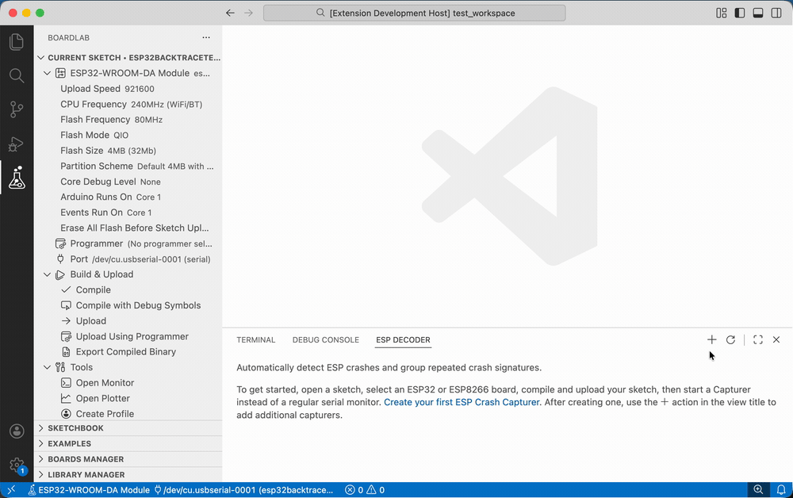
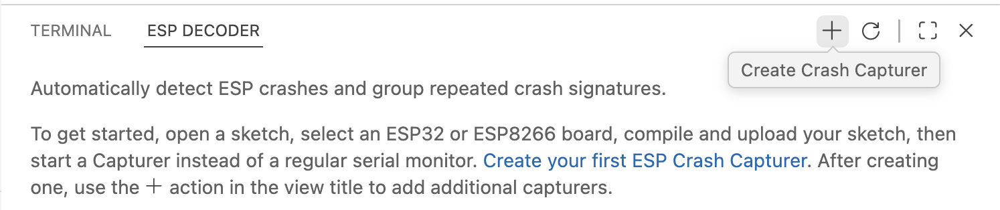
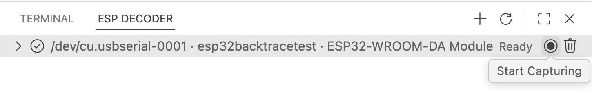
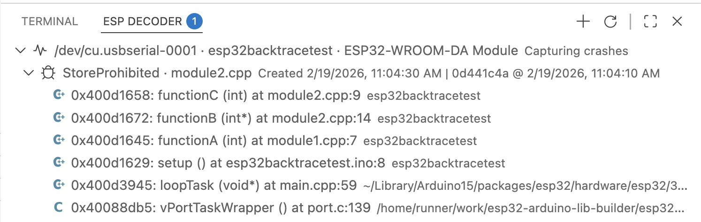
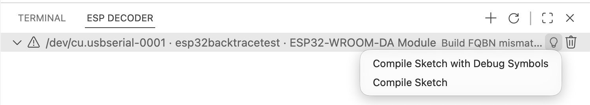
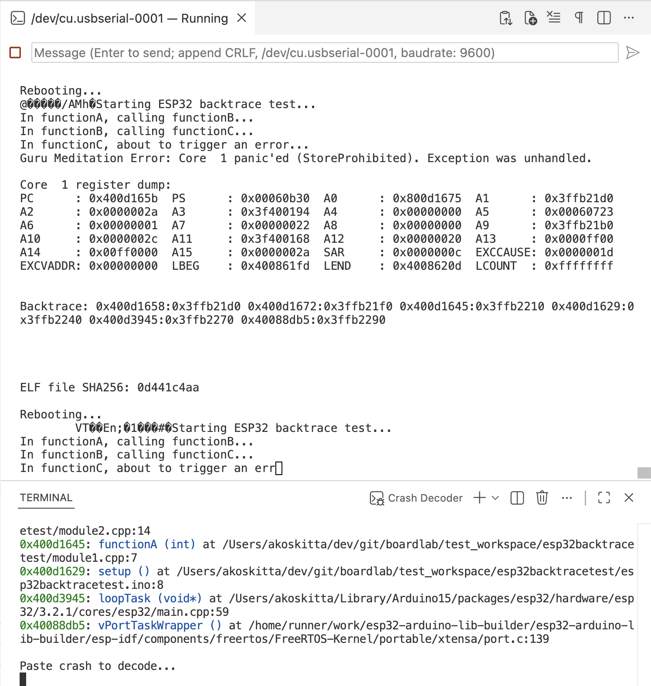

# ESP Exception Decoder

ESP Exception Decoder helps you analyze ESP8266 and ESP32 crashes by decoding stack traces, backtraces, and panic output. It supports both automatic crash capture (recommended) and manual decoding workflows.



- **VS Code (recommended):** Runs as a Visual Studio Code extension and integrates with [BoardLab](https://github.com/dankeboy36/boardlab).
- **Arduino IDE 2.2.x (deprecated):** Only the **1.x** release line is supported via manual VSIX installation.

> [!NOTE]
> **Arduino IDE 2.2.x support is deprecated.**
>
> Starting with version **2.x**, ESP Exception Decoder targets **Visual Studio Code** and requires **BoardLab**.
>
> Arduino IDE 2.2.x users must stay on the **1.x** release line and install the extension manually as a VSIX file.

This extension uses the [TraceBreaker CLI](https://github.com/dankeboy36/trbr) internally. This project is inspired by the original Java-based [ESP8266/ESP32 Exception Stack Trace Decoder](https://github.com/me-no-dev/EspExceptionDecoder). The RISC-V decoder implementation originates from the [`esp_idf_monitor`](https://github.com/espressif/esp-idf-monitor/blob/fae383ecf281655abaa5e65433f671e274316d10/esp_idf_monitor/gdb_panic_server.py).

## Usage

### Recommended: ESP Crash Capturer (VS Code + BoardLab)

1. In BoardLab, select the target **Sketch**, **Board** (`esp32` or `esp8266`), and **Port**.
2. Compile and upload the sketch.
   > [!TIP]
   > Recommended: compile with debug symbols for better stacktrace/source decoding.
3. Open the **ESP Decoder** panel and the **ESP Crash Capturer** view.
4. Click **+** in the view title to create a crash capturer.

   

5. Click **Start Capturing** on the capturer item (this enables crash detection for the current device session). The serial monitor is handled automatically.

   

6. Reproduce the crash on your board while the monitor is running.
7. Open the captured event with **Preview Crash Event**.

   

8. If the capturer reports problems, open **Quick Fixes...** from the capturer item menu.

   

   > [!TIP]
   > FQBN mismatch warnings compare the capturer setup with the sketch/build configuration.
   > They do not verify the exact firmware currently flashed on the board from monitor output.
   > If things look out of sync, recompile, upload again, and sync the capturer target.

The Capturer analyzes the serial monitor stream and groups repeated crash signatures. Each captured crash event can be previewed and decoded without manually copying stack traces. There is no need to stop capturing before compiling or uploading new firmware. Uploads are handled automatically, and a new crash event group is created for the newly flashed ELF. Previously recorded events can be cleared manually if desired.

### Manual: Decoder Terminal (Legacy Workflow)

This workflow is kept for compatibility and for users who already have copied crash output. It does not require a Capturer and works independently of the monitor integration.

Use this if you already have copied crash text and want to decode it manually.

1. Compile the sketch.
2. Upload the sketch to the ESP8266/ESP32 board.
3. Open the serial monitor and wait for a crash (panic output or backtrace).
4. When a crash occurs, open the **ESP Exception Decoder terminal**:
   - Open the _Command Palette_ with <kbd>Ctrl/⌘</kbd>+<kbd>Shift</kbd>+<kbd>P</kbd>.
   - Run `ESP Exception Decoder: Show Decoder Terminal`.
5. Paste the exception stack trace or backtrace into the decoder terminal.

   

   > [!TIP]
   > For terminal copy/paste details, see: https://code.visualstudio.com/docs/terminal/basics#copy-paste

## Installation

### VS Code

Install from the Visual Studio Code Marketplace (required for the 2.x release line).

- ESP Exception Decoder: https://marketplace.visualstudio.com/items?itemName=dankeboy36.esp-exception-decoder

### Arduino IDE 2.2.x (deprecated, 1.x only)

> [!WARNING]
> **Arduino IDE 2.2.x is deprecated for this project.**
>
> Version **2.x and newer will not run in Arduino IDE 2.2.x** and may prevent the IDE from starting correctly.

Arduino IDE does not install VS Code Marketplace extensions automatically. To use this decoder in Arduino IDE 2.2.x, you must manually install a **1.x** VSIX.

1. Download the latest compatible **1.x** extension from the GitHub [release page](https://github.com/dankeboy36/esp-exception-decoder/releases/tag/1.1.1). The filename should be `esp-exception-decoder-${VERSION}.vsix`, where `${VERSION}` is the latest compatible 1.x version.
2. Make sure the Arduino IDE is not running. Then, copy the downloaded extension into the `plugins` folder located in the Arduino IDE's configuration directory. If the `plugins` folder does not exist, create it.
   - On Windows, it's under `%UserProfile%\.arduinoIDE\plugins` (typically `C:\Users\<username>\.arduinoIDE\plugins` where `<username>` is your Windows username).
   - On Linux and macOS, it's under `~/.arduinoIDE/plugins`.
     > [!TIP]
     > If you encounter issues, refer to the [_Installation_](https://github.com/arduino/arduino-ide/blob/main/docs/advanced-usage.md#installation) section of the documentation for Arduino IDE _3rd party themes_. The steps are very similar.

For detailed usage instructions specific to Arduino IDE 2.2.x, refer to the original documentation for the last compatible release:

- Usage guide (1.x): https://github.com/dankeboy36/esp-exception-decoder/tree/1.1.1?tab=readme-ov-file#usage
- Update guide (1.x): https://github.com/dankeboy36/esp-exception-decoder/tree/1.1.1?tab=readme-ov-file#update

## Development

1. Install the dependencies:

   ```sh
   npm i
   ```

2. Build the extension:

   ```sh
   npm run compile
   ```

   > [!TIP]
   > Use `npm run package` to bundle the VSIX for production.

3. Test the extension:

   ```sh
   npm run test
   ```

## Acknowledgments

- Special thanks to [@per1234](https://github.com/per1234) for his dedication to open-source contributions.
- Thanks to [@me-no-dev](https://github.com/me-no-dev) for the [original implementation](https://github.com/me-no-dev/EspExceptionDecoder).
