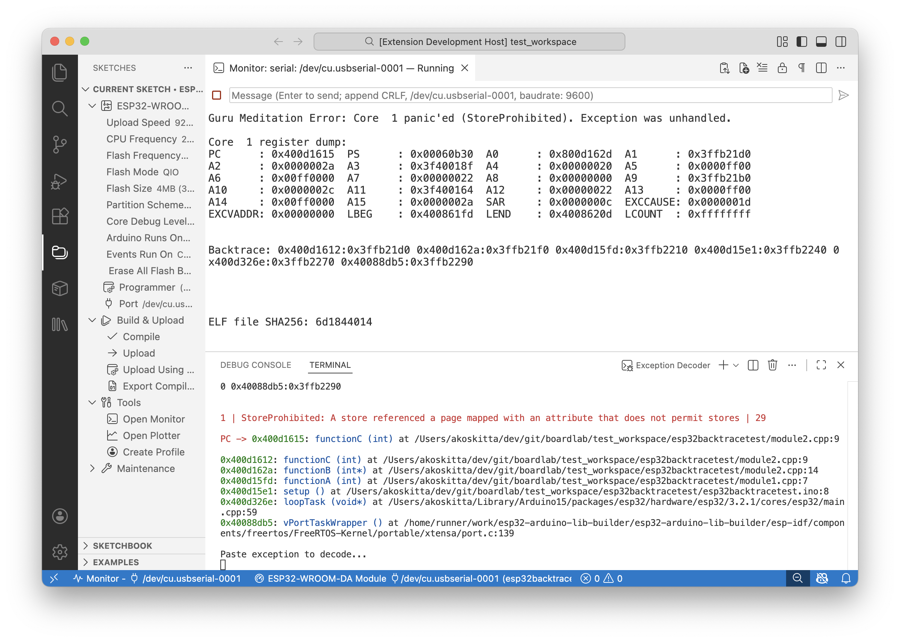

# ESP Exception Decoder

ESP Exception Decoder helps you understand stack traces and backtraces from ESP8266/ESP32 boards.



- **VS Code (recommended):** Runs as a Visual Studio Code extension and integrates with [BoardLab](https://github.com/dankeboy36/boardlab).
- **Arduino IDE 2.2.x (deprecated):** Older versions (1.x) still work when manually installed as a VSIX.

> [!NOTE]
> **Arduino IDE 2.2.x support is deprecated.**
>
> Starting with version **2.x**, ESP Exception Decoder targets **Visual Studio Code** and integrates with **BoardLab**.
>
> Arduino IDE 2.2.x users must stay on the **1.x** release line and install the extension manually as a VSIX.

This extension uses the [TraceBreaker CLI](https://github.com/dankeboy36/trbr) internally. This project is inspired by the original Java-based [ESP8266/ESP32 Exception Stack Trace Decoder](https://github.com/me-no-dev/EspExceptionDecoder). The RISC-V decoder implementation originates from the [`esp_idf_monitor`](https://github.com/espressif/esp-idf-monitor/blob/fae383ecf281655abaa5e65433f671e274316d10/esp_idf_monitor/gdb_panic_server.py).

## Requirements

### VS Code (recommended)

- Visual Studio Code
- [BoardLab](https://marketplace.visualstudio.com/items?itemName=dankeboy36.boardlab)

### Arduino IDE 2.2.x (deprecated, 1.x only)

**Arduino IDE 2.2.0 or newer** is required. The extension relies on features introduced in [arduino/arduino-ide#2110](https://github.com/arduino/arduino-ide/issues/2110). Earlier versions (such as 2.1.1) are not supported and will result in errors like ["Sketch path is not set"](https://github.com/dankeboy36/esp-exception-decoder/issues/45).

## Installation

### VS Code (recommended)

Install from the Visual Studio Code Marketplace.

- ESP Exception Decoder: https://marketplace.visualstudio.com/items?itemName=dankeboy36.esp-exception-decoder

### Arduino IDE 2.2.x (deprecated, 1.x only)

Arduino IDE does not install VS Code Marketplace extensions automatically. To use this decoder in Arduino IDE 2.2.x, you must manually install a **1.x** VSIX.

1. Download the latest compatible **1.x** extension from the GitHub [release page](https://github.com/dankeboy36/esp-exception-decoder/releases/tag/1.1.1). The filename should be `esp-exception-decoder-${VERSION}.vsix`, where `${VERSION}` is the latest version.
2. Make sure the Arduino IDE is not running. Then, copy the downloaded extension into the `plugins` folder located in the Arduino IDE's configuration directory. If the `plugins` folder does not exist, create it.
   - On Windows, it's under `%UserProfile%\.arduinoIDE\plugins` (typically `C:\Users\<username>\.arduinoIDE\plugins` where `<username>` is your Windows username).
   - On Linux and macOS, it's under `~/.arduinoIDE/plugins`.
     > **ⓘ** If you encounter issues, refer to the [_Installation_](https://github.com/arduino/arduino-ide/blob/main/docs/advanced-usage.md#installation) section of the documentation for Arduino IDE _3rd party themes_. The steps are very similar.

For detailed usage instructions specific to Arduino IDE 2.2.x, refer to the original documentation for the last compatible release:

- Usage guide (1.x): https://github.com/dankeboy36/esp-exception-decoder/tree/1.1.1?tab=readme-ov-file#usage
- Update guide (1.x): https://github.com/dankeboy36/esp-exception-decoder/tree/1.1.1?tab=readme-ov-file#update

## Usage

1. Compile the sketch.
2. Upload the sketch to the ESP8266/ESP32 board.
3. Open the monitor and watch for an exception.
4. When an exception occurs, open the _ESP Exception Decoder Terminal_:
   - Open the _Command Palette_ using <kbd>Ctrl/⌘</kbd>+<kbd>Shift</kbd>+<kbd>P</kbd>.
   - Run `ESP Exception Decoder: Show Decoder Terminal`.

5. Paste the exception stack trace or backtrace into the decoder terminal.
   > **ⓘ** For more details on copying and pasting in the terminal, see the VS Code documentation: https://code.visualstudio.com/docs/terminal/basics#copy-paste

## Arduino IDE 2.2.x deprecation notes

> [!WARNING]
> **Arduino IDE 2.2.x is deprecated for this project.**
>
> Version **2.x and newer will not run in Arduino IDE 2.2.x**. Installing them manually may cause startup failures.

Starting with version **2.x**, this project targets **VS Code + BoardLab**.

Arduino IDE 2.2.x uses Eclipse Theia and loads VSIX plugins differently than VS Code. The VS Code version depends on BoardLab, which is intentionally **not loaded** in Arduino IDE.

### What should Arduino IDE users do?

- Stay on the latest **1.x** release.
- Install it manually via the `plugins` folder (see the deprecated installation section above).
- Do **not** install 2.x VSIX files into Arduino IDE.

## Development

1. Install the dependencies:

   ```sh
   npm i
   ```

2. Build the extension:

   ```sh
   npm run compile
   ```

   > **ⓘ** Use `npm run package` to bundle the VSIX for production.

3. Test the extension:

   ```sh
   npm run test
   ```

## Hints

- If you are using VS Code for development, you can take advantage of predefined _Launch Configurations_ to debug the extensions and tests. For guidance on how to [test VS Code extensions](https://code.visualstudio.com/api/working-with-extensions/testing-extension), see the documentation.
- This extension utilizes the [`vscode-arduino-api`](https://github.com/dankeboy36/vscode-arduino-api/) to communicate with the Arduino IDE.
- The extension was created from the [`helloworld`](https://code.visualstudio.com/api/get-started/your-first-extension) VS Code extension template.

## Acknowledgments

- Special thanks to [@per1234](https://github.com/per1234) for his dedication to open-source contributions.
- Thanks to [@me-no-dev](https://github.com/me-no-dev) for the [original implementation](https://github.com/me-no-dev/EspExceptionDecoder).
